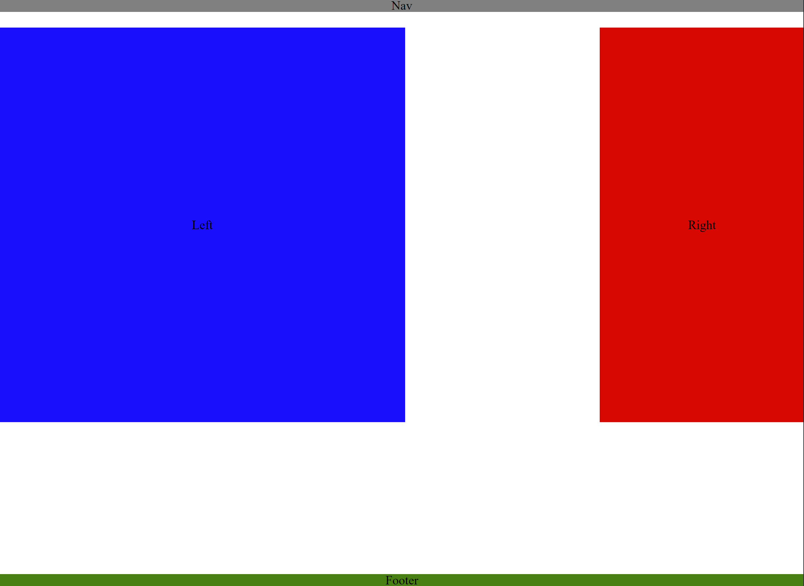

# CSS Assessment

Live Site: <https://dee1985.github.io/css/>

Landing page (black line on right is from screen clipping): 

Description and Usage: Using CSS, this site was an exercise to evaluate CSS knowledge.

Installation: No installation required.

Challenges: Familiarizing myself with CSS syntax.

Successes: I believe it's a fair representation of the image provided in the instructions.

Future Plans: Continue my progress with CSS. Nothing specific at this time for this project.
